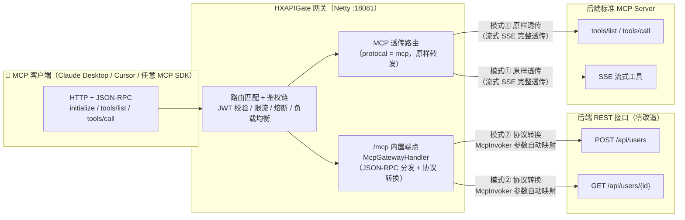
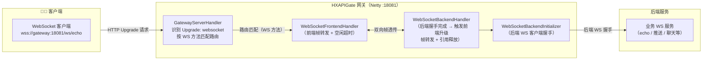

# 高级特性专题

本文档集中介绍 HXAPIGate 的高级特性：**MCP 协议转换网关**、**WebSocket 双向透传代理**、**文件上传/下载代理**，以及**接口熔断 / 分布式限流 / 金丝雀发布**等分布式能力。

## MCP 协议转换网关

HXAPIGate 内置 MCP（Model Context Protocol）支持，提供两种接入模式：

- **模式①：MCP 透传**——协议类型选择 `MCP`，网关将 MCP 客户端的 JSON-RPC 请求**原样转发**给后端标准 MCP Server，网关仅承担鉴权/限流/熔断/负载均衡（后端必须自己实现 MCP 协议）。
- **模式②：HTTP 接口映射为 MCP**——协议类型保持 `HTTP` 并勾选「暴露为MCP工具」，网关内置 `/mcp` 端点将 MCP JSON-RPC **协议转换**为 HTTP 请求（路径参数→URL、其余参数 POST 拼 JSON body / GET 拼 query），后端普通 REST 接口**零改造**即可被 MCP 客户端发现与调用。



### 两种模式对比

| 维度 | 模式①：MCP 透传 | 模式②：HTTP 接口映射为 MCP |
|---|---|---|
| 路由协议类型 | `MCP` | `HTTP` + 「暴露为MCP工具」开关 |
| 后端要求 | 本身就是标准 MCP Server（MCP SDK 实现） | 普通 REST 接口，零改造 |
| 网关动作 | 原样转发（不解析协议） | 协议转换：MCP JSON-RPC ⇄ HTTP |
| 工具清单来源 | 后端自行管理 | 网关从 Redis 路由自动生成 tools/list |
| 典型场景 | 已有 MCP Server 统一收口到网关 | 存量 REST API 资产暴露给 AI 客户端 |

:::tip
模式② 让存量 REST API 资产无需任何改造即可被 Claude Desktop、Cursor 等 MCP 客户端发现与调用，是「存量系统拥抱 AI」的低成本路径。
:::

## WebSocket 双向透传代理

HXAPIGate 支持 WebSocket 协议代理：管理端协议类型选择 `WebSocket` 并配置后端节点（IP:端口 + 权重/TPS），网关识别客户端 `Upgrade: websocket` 握手后，与后端建立 WebSocket 连接并双向透传数据帧。



### 能力清单

| 能力 | 说明 |
|---|---|
| 双向帧透传 | 客户端 ⇄ 网关 ⇄ 后端全双工转发（文本/二进制帧原样透传） |
| 后端主动推送 | 后端 WebSocket 主动下发的消息可经网关透传到达客户端 |
| 断开传播 | 任一端断开，网关自动关闭另一端连接（引用计数释放，无泄漏） |
| 空闲超时 | 可配置：环境变量 `HXAPI_WS_IDLE_TIMEOUT`（或 JVM 参数 `-Dws.idle.timeout`，默认 60s），超时无消息自动断开双向连接 |
| 网关能力复用 | 走标准路由链：鉴权 / 限流 / 熔断 / 负载均衡（ROUND_ROBIN / RANDOM / WEIGHTED / TPS_LIMIT） |

### 使用方式

管理平台 → 接口管理 → 新增 API，代理类型选择 `WebSocket`，填写请求路径（如 `/ws/echo`）与后端节点（如 `127.0.0.1:18085`），保存后网关自动生效；客户端直接连接 `ws://网关地址:18081/ws/echo` 即可。

接口列表中 WebSocket 协议接口的协议标签：


WebSocket 接口编辑（代理类型选择 WebSocket + 后端节点配置）：


```bash
# 使用 wscat 直连网关 WebSocket 代理
wscat -c ws://localhost:18081/ws/echo
```

## 文件上传/下载代理

HXAPIGate 支持 HTTP 文件上传接口代理：客户端以 `multipart/form-data` 请求网关，网关将完整的 multipart 报文（含 boundary 与文件二进制内容）**原样透传**给后端 REST 服务，后端可正常解析 `@RequestPart`/`MultipartFile`；后端返回的文件流（`application/octet-stream` 或任意二进制）同样原样回传。

| 能力 | 说明 |
|---|---|
| multipart 无损透传 | Content-Type/boundary、文件二进制、表单字段全部原样到达后端（已实测 15MB 大文件） |
| 文件下载响应 | 后端二进制响应经透传模式原样回传（Content-Length/chunked 均保留） |
| 大小限制可配 | 环境变量 `HXAPI_MAX_CONTENT_LENGTH`（或 JVM 参数 `-Dmax.content.length`，默认 16MB，单位字节），超限返回 HTTP 413 + JSON 错误说明 `{"code":413,"msg":"request body too large, max xxx bytes"}` |
| 网关能力复用 | 上传/下载走标准路由链：鉴权（JWT 头校验，不解析 body）/ 限流 / 熔断 / 负载均衡 |

### 使用方式

管理平台新增 HTTP 协议接口，后端指向支持文件上传的 REST 服务；客户端直接 `POST http://网关:18081/上传接口`，body 用标准 `multipart/form-data`：

```bash
curl -X POST http://localhost:18081/upload \
  -H "Authorization: <JWT License>" \
  -F "file=@/path/to/15MB.bin"
```

:::note
网关为聚合式代理（请求体在内存中组装后转发），默认 16MB 上限按「小/中文件」场景设计；超大文件（GB 级）建议走对象存储直传或分片上传。
:::

## 接口熔断

- 路由配置支持**熔断参数 UI 可视化配置**：失败阈值 / 成功阈值 / 超时毫秒（见[配置与运维](./config)）
- 熔断采用**状态机管理**，**配置值优先于 TPS 自动推导值**
- 新增接口的路由信息带有安全限制，保障服务运行安全
- 网关核心单元测试覆盖熔断状态机（限流/负载均衡/熔断状态机，14 用例全通过）

## 分布式限流（Redis 计数信号量）

接口分布式限流基于 **Redis 计数信号量**实现：

- 网关集群节点通过 Redis 共享计数信号量，实现**跨节点分布式限流**（单机限流无法覆盖集群场景）
- 支持对 HTTP、Dubbo、MCP、WebSocket 等被代理接口统一限流
- 分布式部署时，网关节点通过 Redis 进行分布式限流与配置同步；管理平台（HXBootShiro）负责 API 路由与鉴权规则的统一管理

## 金丝雀发布

网关已实现**金丝雀发布**能力：新版本服务可以先在部分流量中灰度验证，再逐步放量，降低发布风险。结合路由负载策略（ROUND_ROBIN / RANDOM / WEIGHTED / TPS_LIMIT）与 Redis 配置同步使用，具体接入方式请参考项目 Wiki。

## 总结

| 特性 | 关键点 |
|---|---|
| MCP 协议转换 | 透传（模式①）/ HTTP 映射为 MCP（模式②），存量 REST 零改造暴露给 AI 客户端 |
| WebSocket 双向透传 | 双向帧透传、后端推送、断开传播、空闲超时（默认 60s） |
| 文件上传/下载代理 | multipart 无损透传（实测 15MB），16MB 上限可配，超限 413 |
| 接口熔断 | 状态机管理，失败/成功阈值/超时毫秒 UI 可视化，配置值优先 |
| 分布式限流 | Redis 计数信号量，集群节点共享 |
| 金丝雀发布 | 灰度验证新版本服务，逐步放量 |
